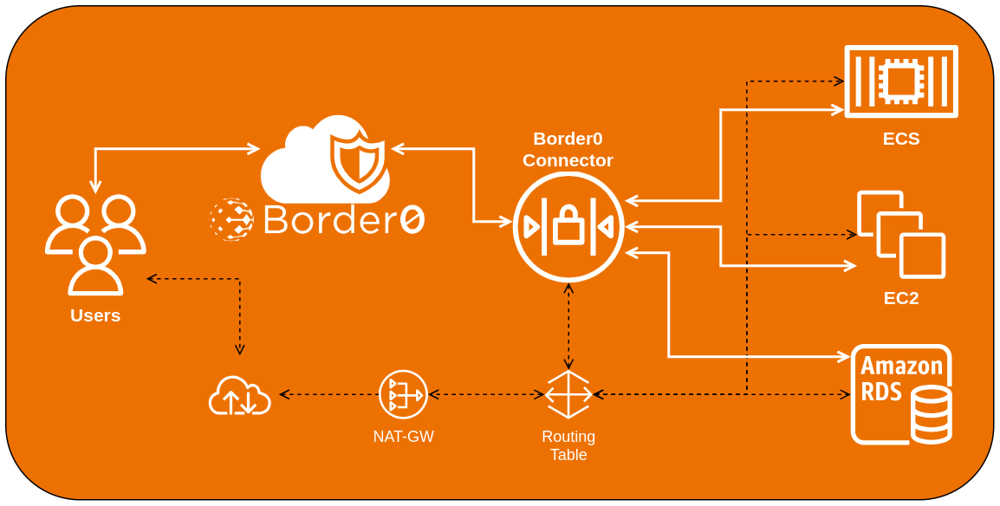

# Getting started with Border0 and Terraform for AWS
This Terraform code will let you start with Border0 in AWS in just a few minutes using the Border0 terraform provider. 
We have automated creating a Border0-enabled infrastructure as a great way to get started with Border0 and see how it works.

## prerequisites prep and assumptions
Before we get started, make sure you have the following:

1. [Border0 Account](https://docs.border0.com/docs/signup) and a Border0 [API Token](https://docs.border0.com/docs/creating-access-token). We recommend you create a token of type [Member](https://portal.border0.com/organizations/current?tab=new_token)

2. AWS Account, Access Key and Secret, you can create them here: [AWS Access Keys](https://console.aws.amazon.com/iam/home?#/security_credentials)

3. Terraform, if you don't already have it, here is [Hashicpro Installation Guide](https://learn.hashicorp.com/tutorials/terraform/install-cli)

> **Caution:** This code creates resources in your AWS account! Once you are finished testing, remove these resources to prevent unnecessary AWS costs. You can delete resources manually or with `terraform destroy`.

## Terraform Module Diagram

## Running the Border0 Terraform example
We will be creating a Border0 enabled infrastructure in AWS with the following resources:
- VPC
    - Two private and one public subnet
    - Internet and NAT Gateways
    - Security Groups
- RDS Instance
- ECS Cluster, Task and Service Definition
- Client/Origin EC2 Instances
- Border0 Connector EC2 Instance


#### 1. Clone this repo:
```
git clone https://github.com/borderzero/terraform-examples.git
```

#### 2. Switch to the terraform-examples directory:
```
cd terraform-examples
```
#### 3. Border0 Credentials setup
Once you create your Border0 account and API [Member Token](https://portal.border0.com/organizations/current?tab=new_token) you can set it up in one of the following ways:

Os Environment Variables
```
export BORDER0_TOKEN="ey...9Iw"
```
or 

Update the ``variables.tf`` file variable ``BORDER0_TOKEN`` to your Border0 API [Member Token](https://portal.border0.com/organizations/current?tab=new_token)

#### 4. AWS Credentials setup

If you have your AWS default credentials set up in your environment and want to use them, you are good to go! 

Otherwise, you can set up your AWS credentials in one of the following ways:

#### 4a. environment variables.
```
export AWS_ACCESS_KEY_ID="anaccesskey"
export AWS_SECRET_ACCESS_KEY="asecretkey"
export AWS_REGION="us-west-2"
export AWS_DEFAULT_REGION="us-west-2"
```

more info on terraform aws provider [docs](https://registry.terraform.io/providers/hashicorp/aws/latest/docs)

#### 4b. Static Credentials
You can run terraform with static credentials, simply update the ``variables.tf`` file with your Border0 API Token, AWS Access Key and Secret
<br>Set the following variables:
- AWS_ACCESS_KEY - AWS Access Key
- AWS_SECRET_KEY - AWS Secret Key
- AWS_REGION - AWS Region


#### 5. Initialise the Terraform:
```
terraform init
```
#### 6. Run the Terraform module:
```
terraform plan && terraform apply
```
Once the Terraform module is done you can navigate to the Border0 Portal and see the newly created infrastructure 
[Admin Portal](https://portal.border0.com/mysockets) and [Client Portal](https://client.border0.com/#/login)

#### 7. Optionally, run cleanup for Terraform module:
```
terraform destroy
```
